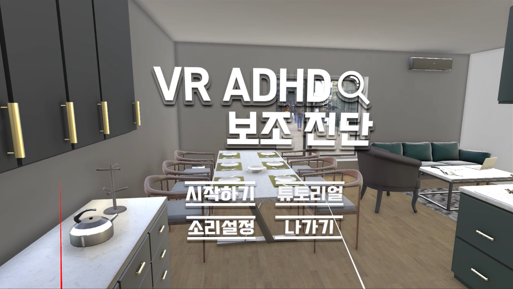
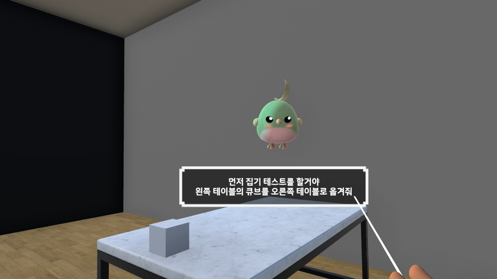
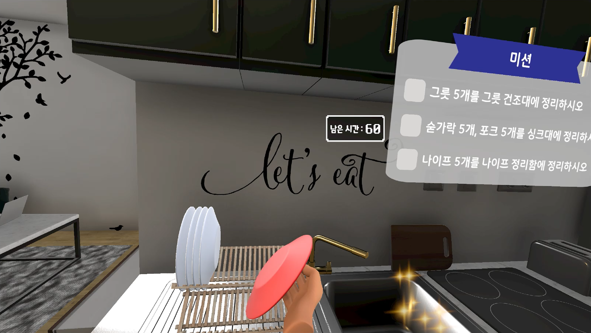
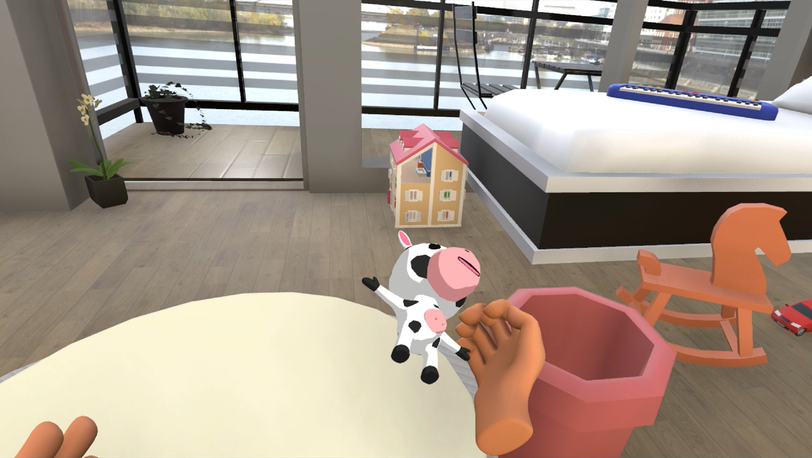
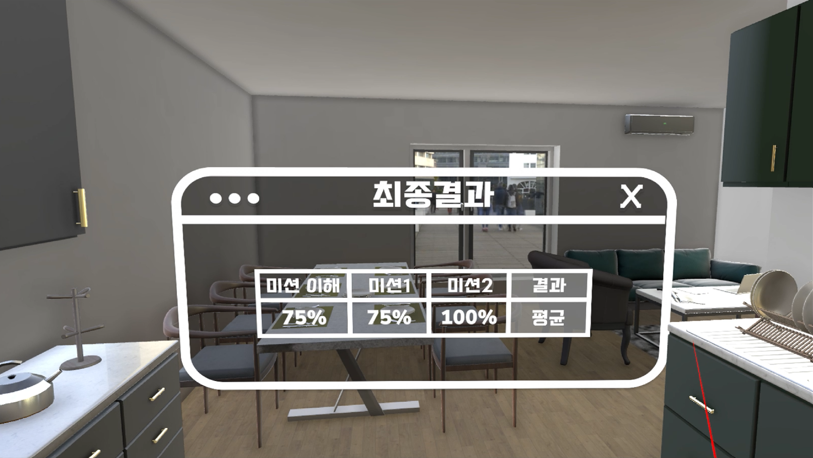
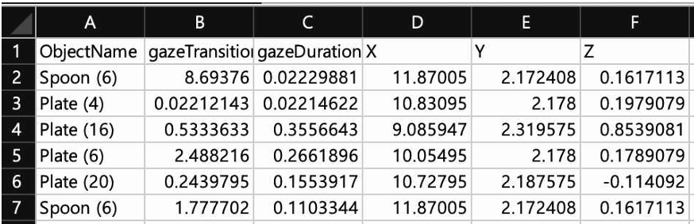
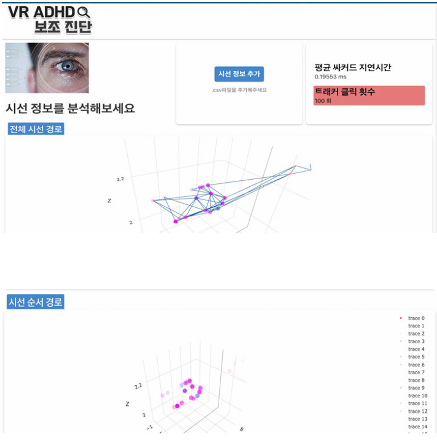

# VR ADHD 보조 진단기

* 아이트래킹을 활용한 VR ADHD 보조 진단 프로그램입니다.
* 주어진 미션에 따라 사용자는 테스트를 진행합니다.
* 모니터링 화면에서 사용자가 바라보는 물체는 색이 빨간색으로 표시됩니다.
* 테스트를 진행하는 동안 사용자의 시선 정보가 .CSV 파일 형태로 저장됩니다.
* .CSV로 저장된 시선 데이터를 웹에서 확인 가능합니다.

 

## 영상
[소개 영상 링크](https://www.youtube.com/watch?v=_n7ylRCQtR8)

 

## 스크린샷

